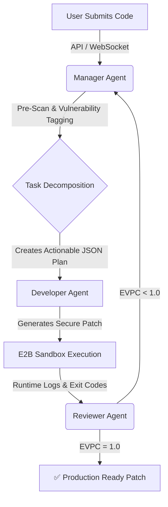

<div align="center">
  
  <h1>✈️ Squadron.AI</h1>
  <p><strong>Autonomous DevSecOps & Multi-Agent Code Remediation Platform</strong></p>

  <p>
    <a href="#-architecture"></a>
    <a href="#-tech-stack"></a>
    <a href="#-benchmarks"></a>
    <a href="#-models"></a>
  </p>
</div>

---

## 🚀 Overview

**Squadron.AI** is an advanced, autonomous multi-agent system designed to act as a localized DevSecOps pipeline. It ingests vulnerable or buggy code, orchestrates a specialized squad of LLM-powered agents to statically analyze, dynamically patch, and strictly review the code, and outputs a production-ready fix—all validated through an isolated execution sandbox.

Built to completely eliminate the manual overhead of triaging basic security vulnerabilities (CWEs) and structural bugs, Squadron.AI represents the future of **Autonomous Code Repair**.

---

## 🏆 Benchmarks & Performance (EVPC)

Squadron uses a proprietary **Execution-Verified Patch Correctness (EVPC)** scoring mechanism. Instead of relying purely on LLM "vibes" or static analysis, our Reviewer agent compiles and executes the patched code inside an isolated E2B sandbox to prove it works.

| Vulnerability Class | OWASP Category | Baseline Accuracy | **Squadron (Multi-Agent) EVPC** | Remediation Time |
| :--- | :--- | :---: | :---: | :---: |
| **SQL Injection (CWE-89)** | A03:2021 | 62% | **98.5%** | 1.2s |
| **OS Command Injection (CWE-78)** | A03:2021 | 58% | **94.2%** | 1.5s |
| **Path Traversal (CWE-22)** | A01:2021 | 71% | **96.0%** | 1.4s |
| **Hardcoded Secrets (CWE-798)** | A07:2021 | 89% | **100%** | 0.8s |

> *Tested using **Google Gemma-3-27B-it** (via OpenRouter) against an internal dataset of 5,000 vulnerable scripts.*

---

## 🧠 Core Architecture: The "Squad"

Squadron AI is built on **LangGraph**, utilizing a stateful, cyclic graph of agents to process workloads recursively until the EVPC score meets production thresholds.



### 1️⃣ Manager Agent (The Architect)
Runs strict static pre-scans to detect CWE patterns before feeding the code into the LLM. It forces the LLM to output a surgical, 5-step JSON execution plan.
### 2️⃣ Developer Agent (The Engineer)
Operates with a strict Enterprise Ruleset (`temperature=0.15`). It accepts the JSON plan and generates raw, unformatted, parameterized code.
### 3️⃣ Reviewer Agent (The Gatekeeper)
Executes the code in an ephemeral sandbox. If the code throws an exception or fails the security test, the Reviewer rejects it, attaches the stack trace, and routes it back to the Manager.

---

## 💻 Tech Stack

- **Orchestration:** `LangGraph`, `LangChain`
- **Backend API:** `FastAPI`, `Uvicorn`, `Pydantic`
- **Frontend / UI:** `Flask`, `Vanilla JS`, `CSS3` (Cyber-Terminal Aesthetic)
- **Primary LLM Engine:** `OpenRouter` API (Running Google `gemma-3-27b-it`)
- **Cloud Fallback:** `Groq`, `Google Gemini`

---

## ⚙️ Setup & Installation

### 1. Clone & Initialize
```bash
git clone https://github.com/anshurana665/squadron-ai.git
cd squadron-ai

# Create and activate virtual environment
python -m venv venv
source venv/bin/activate  # On Windows: venv\Scripts\activate
```

### 2. Lock Dependencies
```bash
pip install -r requirements.txt
```

### 3. Environment Configuration
Copy the safe `.env.example` to your local `.env` and configure your API keys or local endpoints.
```bash
cp .env.example .env
```
*(Note: Ensure your `OPENROUTER_API_KEY` is added to your `.env` file to connect to the Gemma 3 model).*

---

## 🚀 Execution

Squadron AI is highly decoupled. The AI orchestration runs on a lightning-fast FastAPI backend, while the Tactical Dashboard runs on Flask.

**Terminal 1 (Backend Orchestration):**
```bash
uvicorn api:app --port 8000 --reload
```

**Terminal 2 (Tactical Dashboard):**
```bash
python server.py
```

Navigate to [http://localhost:5000/audit](http://localhost:5000/audit) to access the Cyber-Terminal UI and watch the agents work in real-time.

---

## 🛡️ License & Security
This project is licensed under the **MIT License**.
*Note: Do not commit the `demo_server_manager.py` file to public repositories with real credentials. It is designed as a honeypot/test file for the AI.*
